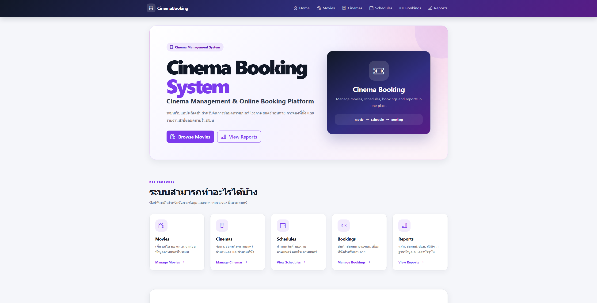
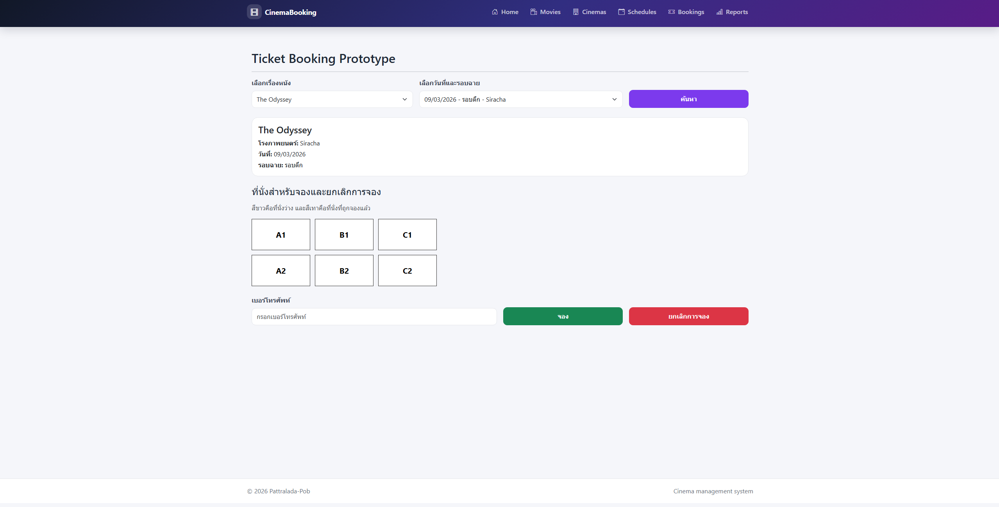
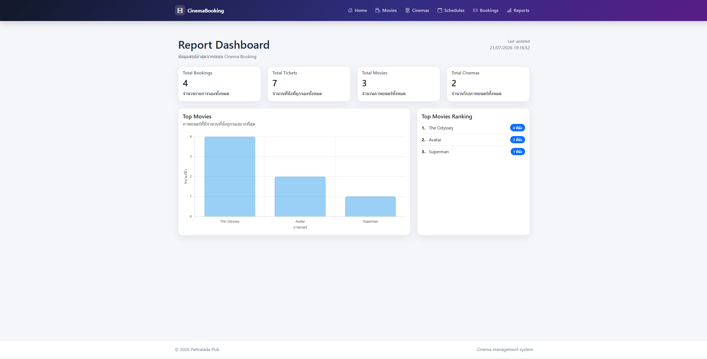

Cinema Booking Web Application
=============

A Razor Pages web application for browsing movies, selecting seats, and making bookings.

Summary
-------
CinemaBooking is a .NET 10 Razor Pages application that provides a simple cinema reservation system: view movies and showtimes, select seats, make bookings, and view basic reporting for administrators.

Key features
-----------
- Browse movies and available screenings
- Seat selection and booking flow
- Booking history and reporting (Views/Report included)
- Admin pages for managing movies, and showtimes

Tech stack
---------
- .NET 10 (ASP.NET Core Razor Pages)
- Entity Framework Core (EF Core) for data access
- SQL Server (or another ADO.NET-compatible relational DB)
- HTML/CSS/JavaScript for UI

Prerequisites
------------
- .NET 10 SDK
- SQL Server (or other supported RDBMS)
- (Optional) EF Core tools: dotnet ef

Local setup
-----------
1. Clone the repository:
   git clone https://github.com/skyandz/CinemaBooking

2. Configure database connection:
   - Open appsettings.json and set the DefaultConnection (or use appsettings.Development.json / environment variables):
	 "ConnectionStrings": {
	   "DefaultConnection": "Server=localhost;Database=CinemaBookingDb;Trusted_Connection=True;MultipleActiveResultSets=true"
	 }

3. Restore and build dependencies:
   dotnet restore
   dotnet build

4. Apply EF Core migrations (if migrations are present):
   dotnet ef database update

5. Run the application:
   dotnet run

6. Open the app in your browser (example): https://localhost:5001 or the URL shown in the console.
